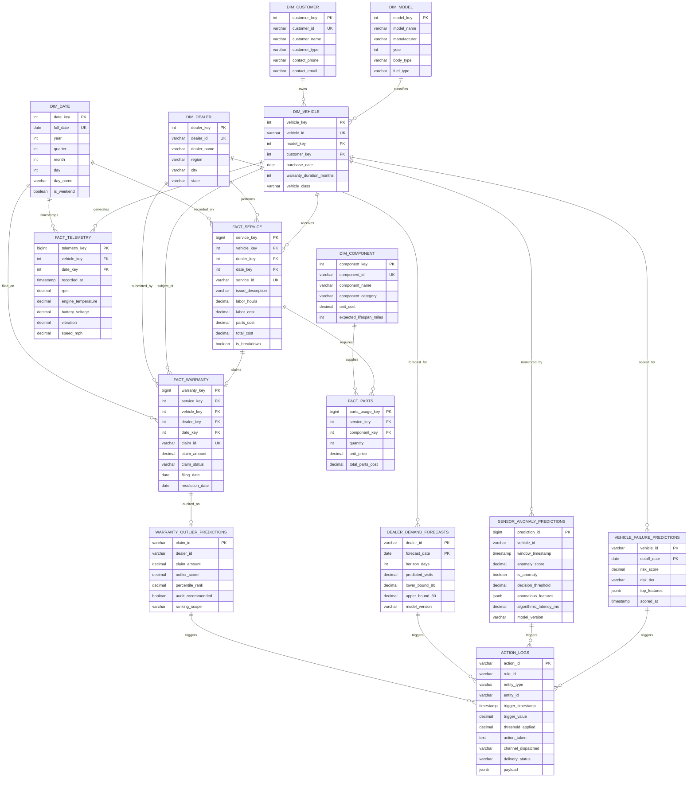

# AutoCare Intelligence — Star Schema & Database ERD Specification

**Document Version:** 1.0.0  
**Phase:** 6 — Productionization & Capstone Delivery  
**Classification:** Database Architecture & Dimensional Model Specification  

---

## 1. Dimensional Model Overview

The AutoCare Intelligence analytical core is architected as an enterprise dimensional Star Schema hosted in PostgreSQL (`autocare_dw` schema), complemented by the operational machine learning inference store (`ml_inference` schema).

The design strictly isolates dimensional entities from transactional fact tables to guarantee high-performance analytical slicing, deterministic grain consistency, and clean dbt model aggregation.

- **Warehouse Schema (`autocare_dw`):** Exactly 6 Dimensions and 4 Facts (10 base tables total).
- **Inference Schema (`ml_inference`):** 4 ML Prediction Tables and 1 Action Audit Log Table (5 base tables total).

---

## 2. Visual Entity-Relationship Diagram (ERD)

---

## 3. Dimension Specifications

### 3.1 `dim_vehicle`
- **Grain:** One row per unique vehicle in the fleet.
- **Surrogate Key:** `vehicle_key` (SERIAL / INT).
- **Natural / Business Key:** `vehicle_id` (e.g., `VH-00101`).
- **Foreign Keys:** `model_key -> dim_model(model_key)`, `customer_key -> dim_customer(customer_key)`.
- **Attributes:** `purchase_date`, `warranty_duration_months`, `vehicle_class` (`PASSENGER`, `COMMERCIAL_LIGHT`, `HEAVY_DUTY`).

### 3.2 `dim_model`
- **Grain:** One row per manufacturer make, model, and year specification.
- **Surrogate Key:** `model_key` (SERIAL / INT).
- **Attributes:** `model_name`, `manufacturer`, `year`, `body_type` (`SEDAN`, `SUV`, `TRUCK`), `fuel_type` (`GASOLINE`, `HYBRID`, `ELECTRIC`).

### 3.3 `dim_dealer`
- **Grain:** One row per authorized dealership service center.
- **Surrogate Key:** `dealer_key` (SERIAL / INT).
- **Natural / Business Key:** `dealer_id` (e.g., `DLR-001`).
- **Attributes:** `dealer_name`, `region`, `city`, `state`.

### 3.4 `dim_customer`
- **Grain:** One row per registered vehicle owner or corporate fleet entity.
- **Surrogate Key:** `customer_key` (SERIAL / INT).
- **Natural / Business Key:** `customer_id` (e.g., `CUST-0042`).
- **Attributes:** `customer_name`, `customer_type` (`INDIVIDUAL`, `COMMERCIAL_FLEET`), contact metadata.

### 3.5 `dim_date`
- **Grain:** One row per calendar day.
- **Surrogate Key:** `date_key` (INT in format `YYYYMMDD`).
- **Natural Key:** `full_date` (DATE).
- **Attributes:** `year`, `quarter`, `month`, `day`, `day_name`, `is_weekend`, `is_holiday`.

### 3.6 `dim_component`
- **Grain:** One row per serviceable vehicle part/component.
- **Surrogate Key:** `component_key` (SERIAL / INT).
- **Natural / Business Key:** `component_id` (e.g., `CMP-007`).
- **Attributes:** `component_name`, `component_category` (`BRAKE`, `POWERTRAIN`, `ELECTRICAL`, `COOLING`), `unit_cost`, `expected_lifespan_miles`.

---

## 4. Fact Specifications

### 4.1 `fact_telemetry`
- **Grain:** One row per aggregated 1-minute vehicle sensor ping window.
- **Primary Key:** `telemetry_key` (BIGSERIAL).
- **Foreign Keys:** `vehicle_key`, `date_key`.
- **Approved Sensor Attributes:**
  - `rpm` (Revolutions Per Minute)
  - `engine_temperature` (Celsius)
  - `battery_voltage` (Volts)
  - `vibration` (mm/s RMS)
  - `speed_mph` (Speed in miles per hour)
- **Note:** Excludes ambient temperature and vehicle class per ratified ML feature set contracts.

### 4.2 `fact_service`
- **Grain:** One row per completed dealership service order.
- **Primary Key:** `service_key` (BIGSERIAL).
- **Natural Key:** `service_id` (e.g., `SRV-008912`).
- **Foreign Keys:** `vehicle_key`, `dealer_key`, `date_key`.
- **Metrics & Indicators:** `labor_hours`, `labor_cost`, `parts_cost`, `total_cost`, `is_breakdown` (deterministic boolean derived from `is_breakdown_issue()`).

### 4.3 `fact_warranty`
- **Grain:** One row per warranty reimbursement claim filed.
- **Primary Key:** `warranty_key` (BIGSERIAL).
- **Natural Key:** `claim_id` (e.g., `CLM-00912`).
- **Foreign Keys:** `service_key`, `vehicle_key`, `dealer_key`, `date_key`.
- **Attributes & Financials:** `claim_amount`, `claim_status` (`APPROVED`, `UNDER_REVIEW`, `REJECTED`), `filing_date`, `resolution_date`.

### 4.4 `fact_parts`
- **Grain:** One row per line-item part consumed on a service order.
- **Primary Key:** `parts_usage_key` (BIGSERIAL).
- **Foreign Keys:** `service_key`, `component_key`.
- **Financials:** `quantity`, `unit_price`, `total_parts_cost`.

---

## 5. Machine Learning Schema (`ml_inference`)

The `ml_inference` schema houses predictions and audit trails generated by production ML models and the rule engine:

| Table Name | Primary Key | Key Attributes | Purpose |
|---|---|---|---|
| `vehicle_failure_predictions` | `(vehicle_id, cutoff_date)` | `risk_score`, `risk_tier`, `top_features`, `scored_at` | 14-day vehicle failure risk probability and tiering |
| `sensor_anomaly_predictions` | `prediction_id` (BIGSERIAL) | `anomaly_score`, `is_anomaly`, `decision_threshold`, `algorithmic_latency_ms` | Real-time sensor anomaly scoring history |
| `dealer_demand_forecasts` | `(dealer_id, forecast_date)` | `predicted_visits`, `lower_bound_80`, `upper_bound_80`, `horizon_days` | 14-day service bay capacity demand projections |
| `warranty_outlier_predictions` | `claim_id` | `claim_amount`, `outlier_score`, `percentile_rank`, `audit_recommended` | Forensic warranty claim outlier audit prioritization |
| `action_logs` | `action_id` (UUID) | `rule_id`, `entity_type`, `entity_id`, `trigger_value`, `threshold_applied`, `delivery_status`, `payload` | Immutable audit trail of automated actions dispatched |

---

## 6. Schema Governance & Role Invariants

1. **Schema Partitioning:** Analytical tables reside in `autocare_dw`. Machine learning artifacts and audit logs reside in `ml_inference`. Staging raw tables reside in `staging`.
2. **Role Immutability:**
   - `autocare_backend`: Holds `SELECT` on all 10 `autocare_dw` tables and 5 `ml_inference` tables. Holds zero DDL or write permissions.
   - `autocare_worker`: Holds `SELECT` on `ml_inference` predictions and `INSERT` exclusively on `ml_inference.action_logs`. Holds zero delete/update permissions.
   - Superuser `postgres`: Exclusively holds DDL and table management privileges.
