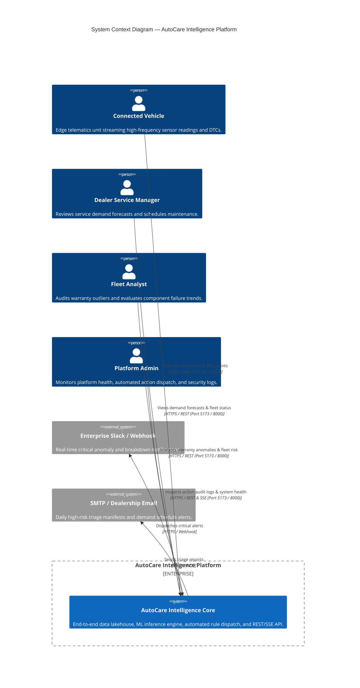
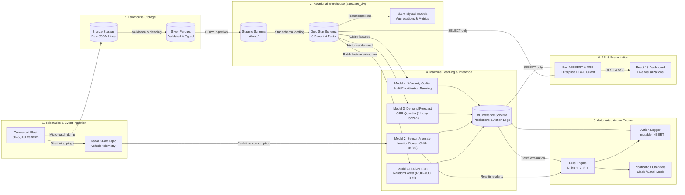
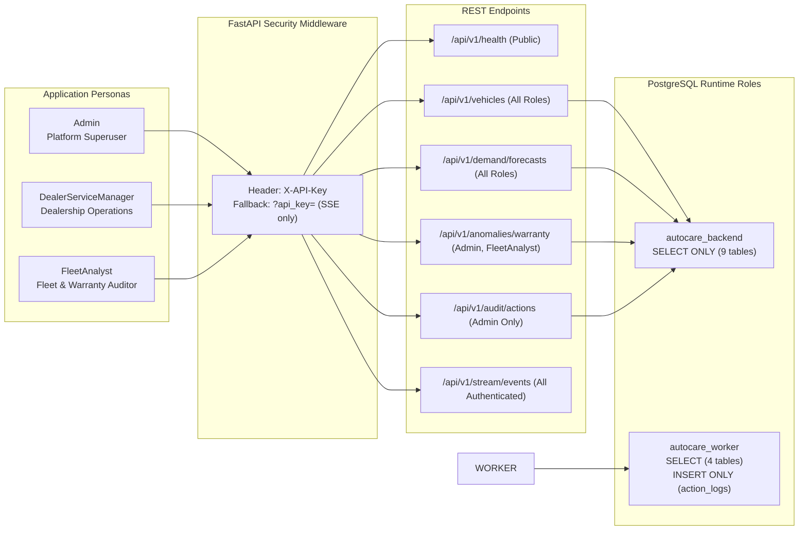

# AutoCare Intelligence — End-to-End System Architecture

**Document Version:** 1.0.0  
**Phase:** 6 — Productionization & Capstone Delivery  
**Classification:** Technical System Specification & Architectural Reference  

---

## 1. Executive Summary

AutoCare Intelligence is an enterprise-grade predictive maintenance, warranty analytics, and automated decisioning platform for connected vehicle fleets. The platform continuously ingests high-frequency IoT sensor telemetry, diagnostic trouble codes (DTCs), service records, and warranty claims; processes them through a multi-tier Medallion Lakehouse architecture; models failure dynamics via production machine learning; and enforces real-time closed-loop automated interventions with immutable audit logging.

This document describes the high-level architecture, container topology, data flow, dual-path streaming inference, security controls, and networking contracts across the five core platform tiers.

---

## 2. High-Level C4 Context Diagram

The following C4 Context diagram illustrates how external vehicle fleets, dealership networks, and platform operators interact with the AutoCare Intelligence platform boundary.



---

## 3. Container Topology & Network Architecture

The platform runs as a 5-tier orchestrated container topology governed by Docker Compose. Each container is configured with strict health checks, non-root execution, resource boundaries, and environment-provided fail-fast secrets.

```mermaid
graph TD
    subgraph Host Network ["Host Interface (0.0.0.0)"]
        P_FE["Port 3000 (Docker) / 5173 (Dev)"]
        P_BE["Port 8000 (Backend API & SSE)"]
        P_PG["Port 5432 (PostgreSQL Data Warehouse)"]
        P_KF["Port 9092 (Kafka KRaft Broker)"]
    end

    subgraph Docker Network ["autocare-net (172.28.0.0/16 Bridge)"]
        FE["autocare-frontend<br/>React 18 + Vite Production Server<br/>Port 3000 (Internal)"]
        BE["autocare-backend<br/>FastAPI + Uvicorn<br/>Port 8000 (Internal)"]
        WORKER["autocare-automation-worker<br/>Python 3.10 Daemon<br/>Continuous Supervisor Loop"]
        PG[("autocare-postgres<br/>PostgreSQL 16 Alpine<br/>Port 5432 (Internal)")]
        KF["autocare-kafka<br/>Apache Kafka 3.7 (KRaft Mode)<br/>Port 9092 (Internal)"]
    end

    P_FE --> FE
    P_BE --> BE
    P_PG --> PG
    P_KF --> KF

    FE -->|HTTP / SSE REST| BE
    BE -->|SQL queries (SELECT only)| PG
    BE -.->|Live Telemetry Fallback| KF
    WORKER -->|Consume vehicle-telemetry| KF
    WORKER -->|Batch Read / Append Logs| PG
```

### Container Specifications

| Container Name | Base Image | Role | Bound Ports | Healthcheck Mechanism |
|---|---|---|---|---|
| `autocare-postgres` | `postgres:16-alpine` | Warehouse, lakehouse staging, and ML inference store | `5432:5432` | `pg_isready -U postgres -d autocare_dw` |
| `autocare-kafka` | `apache/kafka:3.7.0` | Event bus for real-time telemetry streaming (KRaft mode) | `9092:9092` | `/opt/kafka/bin/kafka-broker-api-versions.sh` |
| `autocare-backend` | `python:3.10-slim` | FastAPI REST & SSE server with 3-tier RBAC | `8000:8000` | `curl -f http://localhost:8000/api/v1/health` |
| `autocare-frontend` | `node:20-alpine` | React 18 SPA with TailwindCSS & Recharts | `3000:3000` | `wget --spider http://127.0.0.1:3000/` |
| `autocare-automation-worker` | `python:3.10-slim` | Kafka consumer, streaming scorer, and rule evaluator | None | `pgrep -f '[a]utomation.worker'` |

---

## 4. End-to-End Multi-Tier Data Flow

The platform implements a Medallion Architecture (Bronze -> Silver -> Gold) coupled with near-real-time streaming inference:



---

## 5. Dual-Path Streaming & Batch Architecture

To balance low-latency alerting with high-throughput historical training and compaction, AutoCare Intelligence implements a dual-path pipeline:

```mermaid
flowchart TD
    KAFKA["Kafka Topic: vehicle-telemetry"]

    subgraph FastPath ["Real-Time Streaming Path (< 10 ms)"]
        C_FAST["AutomationWorker Consumer<br/>autocare-automation-group"]
        SCORER["StreamingSensorScorer<br/>Algorithmic Latency < 5 ms"]
        RULE2["Rule 2 Evaluator<br/>Consecutive Anomaly Filter"]
        SLACK_DISPATCH["Slack Notification Webhook"]
        LOG_INSERT["Action Logger<br/>INSERT into ml_inference.action_logs"]
    end

    subgraph BatchPath ["Analytical Batch & Compaction Path (Airflow / dbt)"]
        DAG_HOURLY["Hourly Bronze Ingestion DAG"]
        BRONZE_SINK["Bronze Raw Storage (JSONL)"]
        CLEANER["Silver Cleaning & Parquet Compaction"]
        SILVER_SINK["Silver Parquet Archive"]
        DW_LOAD["Gold Warehouse Ingestion (PostgreSQL)"]
        DBT_RUN["dbt Transformations & Marts"]
        BATCH_ML["Daily ML Retraining & Cutoff Scoring"]
    end

    KAFKA -->|Continuous event stream| C_FAST
    C_FAST --> SCORER
    SCORER --> RULE2
    RULE2 -->|Threshold exceeded (3x)| SLACK_DISPATCH
    RULE2 -->|Audit record| LOG_INSERT

    KAFKA -->|Micro-batch consume| DAG_HOURLY
    DAG_HOURLY --> BRONZE_SINK
    BRONZE_SINK --> CLEANER
    CLEANER --> SILVER_SINK
    SILVER_SINK --> DW_LOAD
    DW_LOAD --> DBT_RUN
    DBT_RUN --> BATCH_ML
```

---

## 6. Enterprise Security & Database RBAC Model

The platform strictly isolates privileges across operating roles and database identities:



### Immutable Security Invariants
1. **Zero Write Privileges on Backend:** `autocare_backend` cannot execute `INSERT`, `UPDATE`, `DELETE`, `TRUNCATE`, or `ALTER` anywhere in the database.
2. **Immutable Action Logs:** `autocare_worker` holds `INSERT` privilege on `ml_inference.action_logs` and zero update/delete permissions. Historical actions can never be overwritten or erased.
3. **Fail-Fast Secret Enforcement:** If `AUTOCARE_ADMIN_KEY`, `AUTOCARE_DEALER_KEY`, or `AUTOCARE_ANALYST_KEY` are unset or empty, the API server terminates immediately at startup. No default fallback keys exist.
