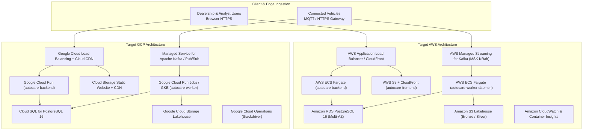
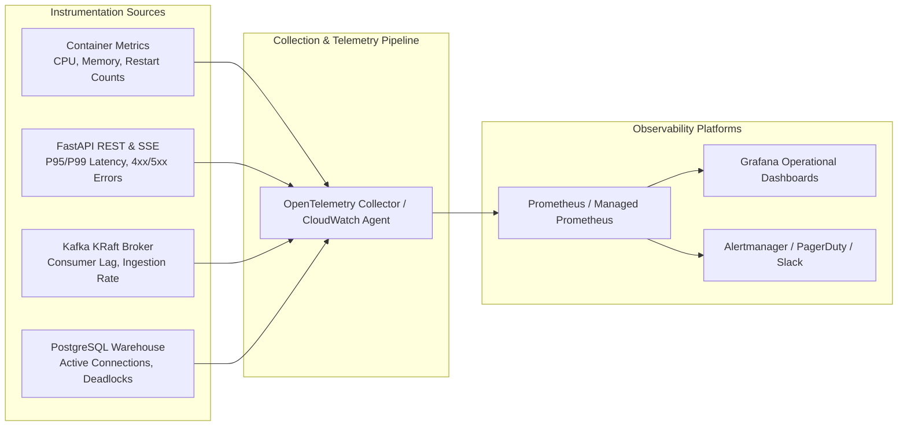

# AutoCare Intelligence — Cloud Deployment Architecture & TCO Cost Model

**Document Version:** 1.0.0  
**Phase:** 6 — Productionization & Capstone Delivery  
**Classification:** Cloud Engineering, Infrastructure Architecture & Financial Model  

---

## 1. Cloud Deployment Governance Status

> [!WARNING]
> ### GOVERNANCE AUDIT NOTICE — ACTUAL CLOUD DEPLOYMENT STATUS: **BLOCKED**
> Per the authoritative requirements of `AutoCare_Intelligence.pdf` (Section 15 & Section 17) and explicit Project Owner directives:
> - **Operational Evidence:** The local multi-container Docker runtime topology (`autocare-postgres`, `autocare-kafka`, `autocare-backend`, `autocare-frontend`, `autocare-automation-worker`) is fully verified, healthy, and operational.
> - **Cloud Status:** Live automated provisioning and hosting on a public cloud provider (AWS / GCP / Azure) is **BLOCKED** pending the Project Owner's provision of active cloud account credentials, funded billing accounts, and target environment VPC allocations.
> - **Conformance:** Under no circumstances should local Docker Compose orchestration or documentation specifications be misconstrued or represented as completed cloud deployment. This document provides the complete, authoritative infrastructure blueprints, infrastructure-as-code manifests, and financial TCO models ready for instant deployment upon credential provisioning.

---

## 2. Cloud Architecture & Service Mapping

AutoCare Intelligence is containerized and cloud-agnostic. The table below details the direct mapping between local Docker Compose components and fully managed hyperscaler cloud primitives on Amazon Web Services (AWS) and Google Cloud Platform (GCP).

### Component Mapping Reference

| Platform Component | Local Runtime (Stage 4) | AWS Cloud Equivalent | GCP Cloud Equivalent |
|---|---|---|---|
| **Data Warehouse & Inference** | PostgreSQL 16 Alpine container | Amazon RDS PostgreSQL 16 (Multi-AZ, db.t4g/m6g) | Cloud SQL for PostgreSQL 16 (High Availability) |
| **Streaming Bus** | Apache Kafka 3.7 (KRaft) | AWS MSK (Managed Streaming for Kafka) KRaft mode | Managed Service for Apache Kafka / Google Cloud Pub/Sub |
| **Backend API & SSE** | FastAPI / Uvicorn container | AWS ECS Fargate (Auto-scaling, ALB) | Google Cloud Run (Container concurrency auto-scale) |
| **Frontend Web Dashboard** | React 18 / Nginx container | Amazon S3 + CloudFront Distribution | Google Cloud Storage Bucket + Cloud CDN |
| **Automation Worker** | Python 3.10 Supervisor container | AWS ECS Fargate Service (continuous supervisor) | Google Cloud Run Jobs / GKE Autopilot daemon |
| **Lakehouse Object Store** | Local filesystem (`data/lakehouse`) | Amazon S3 (Standard + Glacier Lifecycle) | Google Cloud Storage (Standard + Nearline Lifecycle) |
| **Secret Management** | Environment-provided fail-fast | AWS Secrets Manager / Parameter Store | Google Secret Manager |
| **Logging & Monitoring** | Docker health checks & logs | Amazon CloudWatch + Container Insights + X-Ray | Google Cloud Operations Suite (Cloud Logging / Metrics) |

---

## 3. Total Cost of Ownership (TCO) Financial Model

Cost estimations are modeled across three progressive operational fleet tiers based on published on-demand commercial rates (US-East / us-central1 regions, calculated monthly):

1. **Small Fleet Tier:** 50 connected vehicles (~72,000 pings/day).
2. **Medium Fleet Tier:** 500 connected vehicles (~720,000 pings/day).
3. **Large Enterprise Tier:** 5,000 connected vehicles (~7,200,000 pings/day).

### 3.1 Monthly Cost Breakdown by Tier (USD)

| Infrastructure Category | Small Fleet (50 Vehicles) | Medium Fleet (500 Vehicles) | Large Fleet (5,000 Vehicles) | Cost Drivers & Sizing Basis |
|---|---|---|---|---|
| **Relational Database (PostgreSQL)** | \$42.50 | \$145.00 | \$580.00 | Small: `db.t4g.small` (2 vCPU, 2GB, 50GB gp3); Med: `db.m6g.large` (2 vCPU, 8GB, 250GB gp3); Large: `db.m6g.2xlarge` Multi-AZ (8 vCPU, 32GB, 1TB gp3). |
| **Kafka Event Bus** | \$35.00 | \$165.00 | \$420.00 | Small: Self-managed Kafka on EC2 (`t4g.medium`) or MSK Serverless; Med: MSK Serverless (2 partitions); Large: MSK Provisioned 3-broker cluster (`kafka.m5.large`). |
| **Compute — Backend API & Worker** | \$30.00 | \$90.00 | \$320.00 | AWS ECS Fargate: Small: 1 vCPU / 2GB RAM; Med: 2 tasks (2 vCPU / 4GB RAM); Large: 4 tasks auto-scaled (4 vCPU / 8GB RAM). |
| **Frontend Web Hosting & CDN** | \$2.50 | \$8.00 | \$35.00 | Amazon S3 + CloudFront CDN: Data egress, SSL certificate, edge caching. |
| **Lakehouse Storage (Bronze/Silver)** | \$1.20 | \$9.50 | \$78.00 | S3 Standard: Small: 20GB/mo; Med: 250GB/mo; Large: 2.5TB/mo with 90-day transition to S3 Glacier Flexible. |
| **Networking & Load Balancer** | \$22.00 | \$25.00 | \$45.00 | AWS Application Load Balancer (ALB) base hours + LCU metric processing. |
| **Observability & Secrets Manager** | \$8.00 | \$25.00 | \$85.00 | CloudWatch logs ingestion (5GB/mo -> 50GB/mo), custom metrics, 5 Secrets Manager secrets. |
| **TOTAL ESTIMATED MONTHLY TCO** | **\$141.20 / mo** | **\$467.50 / mo** | **\$1,563.00 / mo** | **Annualized: \$1,694.40 (Small) \| \$5,610.00 (Med) \| \$18,756.00 (Large)** |

### 3.2 Per-Vehicle Monthly Unit Economics
- **Small Fleet (50 Vehicles):** \$2.82 per vehicle/month
- **Medium Fleet (500 Vehicles):** \$0.94 per vehicle/month *(66.7% efficiency gain from shared infrastructure amortisation)*
- **Large Enterprise Fleet (5,000 Vehicles):** \$0.31 per vehicle/month *(89.0% efficiency gain at scale)*

---

## 4. Cloud Monitoring & Observability Architecture

The production observability stack is structured into four monitoring pillars:

### Production Alerting Thresholds
1. **API Latency Degradation:** P95 response time > 250 ms across a 5-minute rolling window -> Warning; P95 > 500 ms -> Critical (PagerDuty).
2. **Kafka Consumer Lag:** `autocare-automation-group` lag > 500 records sustained for 60 seconds -> Critical (Worker stall).
3. **Database Connection Saturation:** PostgreSQL active connections > 85% of `max_connections` (100) -> Warning.
4. **Consecutive Container Restarts:** Any container restarting > 2 times within 15 minutes -> Critical alert dispatched to Platform Operations Slack.
5. **Worker Execution Liveness:** No action logged or empty consumer loop for > 30 minutes during fleet operating hours -> Warning.
